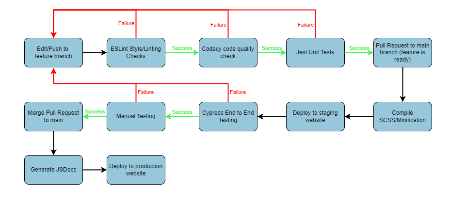

## Pipeline diagram

## Overview
  
### 1. Edit/Push to Feature Branch
The first step in our pipeline occurs when new code is pushed to a feature branch (`[feature type]/[feature name]`). These branches are where new features for our web app are first created by developers. 

The `lint.yml` and `jest.yml` workflows are triggered when a developer makes a push to a feature branch involving changes to `*.js` files. 

### 2. ESLint Style/Linting checks 
The next step in our pipeline is to run the ESLint tool for linting and code style enforcement.

This step is implemented using Github Actions and is defined as the first job in the workflow at `.github/workflows/lint.yml`. This workflow runs the linter configured with the Airbnb style guide on the code. This step in our pipeline is currently functional and will continue to work as we add new feature branches. 

### 3. Codacy code quality check
Once the code goes through the linter, we then run a Codacy code quality check on the code

This step is implemented using Github Actions and is defined as the second job in the workflow at `.github/workflows/lint.yml`. This workflow runs the [Codacy Analysis CLI Github Action](https://github.com/marketplace/actions/codacy-analysis-cli) which performs a static code analysis on the code and fails if the analysis finds any issues. This step in our pipeline is currently functional and will continue to work as we add new code. 

### 4. Automated Jest unit tests
After the code goes through the code quality check, we then run our automated unit tests on the code using Jest. 

This step is implemented using Github Actions and is defined in the workflow at `.github/workflows/jest.yml`. This job runs the command `npm run test` which runs our unit tests (located in the `source/__tests__` folder) on the source code. This step in our pipeline is currently functional and will continue to work as we add new source code and tests. 

### 5. Pull Request to main
Once the feature is ready and has passed through the linter and Jest unit tests, the developer can then make a new pull request to the `main` branch.

The `staging.yml` workflow is triggered whenever a developer opens a pull request to main involving files in the `source/` folder. 

### 6. Compile SCSS/Minification
After a pull request is made, the next step in the pipeline is to build the code for preliminary deployment. This involved compiling the SCSS to CSS and performing minification on the code. 

This step is implemented using the `build` npm script defined in `package.json`. This script uses the [Parcel Web Application Bundler](https://www.npmjs.com/package/parcel) to compile the SCSS and bundle the source code for deployment. The minified code is then output to the `dist/` folder. This step in our pipeline is currently functional and will continue to work as we make new deployments. 

### 7. Deploy to staging website
After the SCSS is compiled and the code goes through minification, the next step is to deploy a preliminary version of the website with the new feature for end-to-end/manual testing. 

This step is implemented using Github Actions and is the first job defined in the workflow at `.github/workflows/staging.yml`. After building the code using the build script described in the previous step, the workflow uses the [Deploy to Firebase Hosting Github Action](https://github.com/marketplace/actions/deploy-to-firebase-hosting) to deploy the feature branch code to a Firebase preview channel. After deployment, the action leaves a comment with preview channel URL on the pull request for manual review. This step in our pipeline is currently functional and will continue to work as we add new features. 

### 8. End-to-End testing
Once the staging website is deployed, the next step is to run our automated end-to-end tests on the website using Cypress. 

This step is implemented using Github Actions and is the second job defined in the workflow at `.github/workflows/staging.yml`. This job uses the [Cypress Github Action](https://github.com/marketplace/actions/cypress-io) to run Cypress end-to-end tests (located in `cypress/integration`) on the staging website. This step in our pipeline is currently functional and will continue to work as we add new source code/end-to-end tests. 

### 9. Manual testing 
After the code passes the end-to-end tests, the pull request is reviewed and the new feature can be manually tested by developers. 

### 10. Merge Pull Request to main
After the new feature code passes both the end-to-end and manual tests, the pull request can be merged to the `main` branch. 

The `deploy.yml` workflow is triggered whenever a developer closes a pull request to main involving files in the `source/` folder.

### 11. Generate JSDocs
Once the code is successfully merged, the next step in our pipeline involves automatically generating documentation from the code. 

This step is implemented using Github Actions and is the first job defined in the workflow at `.github/workflows/deploy.yml`. This job first runs the command `npm run generate-docs` to generate JSDocs for the source code. The job then pushes the generated JSDocs to the `main` branch. This step in our pipeline is currently functional and will continue to work as we add more source code/JSDocs.

### 12. Deploy to production website
The final step in our pipeline is deploying the new feature to the production website, which occurs when the code has arrived on the `main` branch and JSDocs are generated.  

This step is implemented using Github Actions and is the second job defined in the workflow at `.github/workflows/deploy.yml`. After running the build script on the source code, the job pushes the code and docs in the `dist/` folder to the `production` branch and deploys the branch to Github Pages. This step in our pipeline is currently functional and will continue to work as we add new features to the web app. 

## Demo video
A video demo of our phase 1 pipeline can be found [here](https://youtu.be/7XHOY6MUNAA)